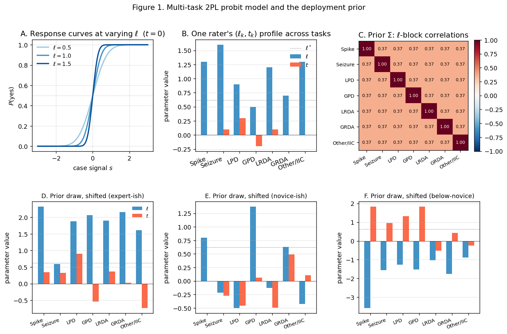
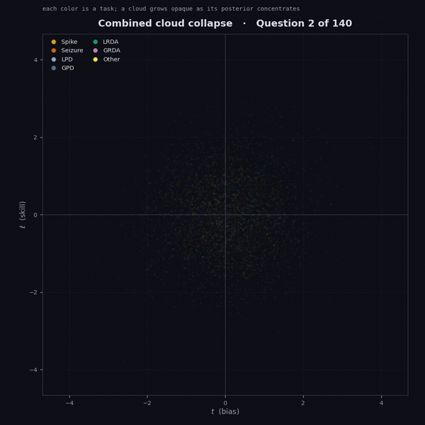
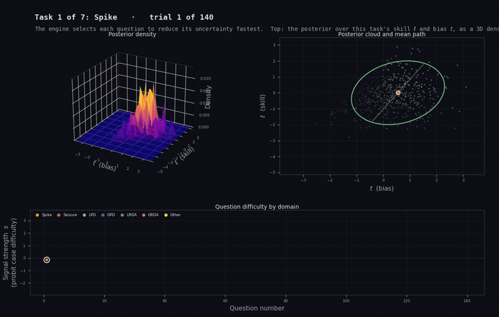
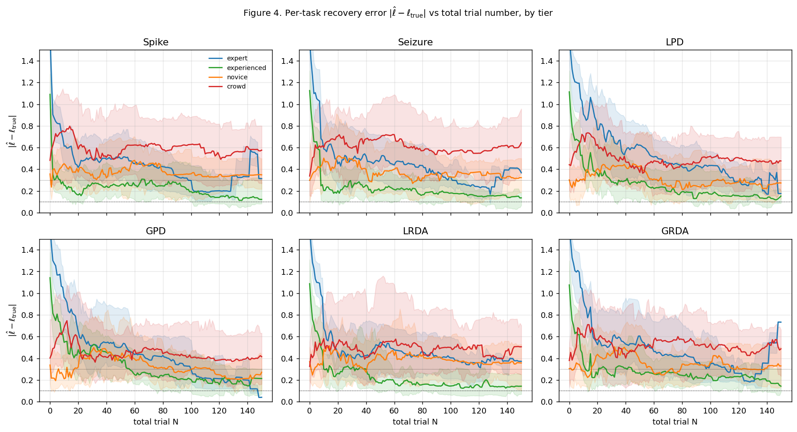
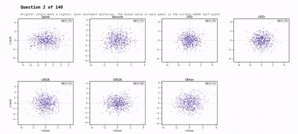
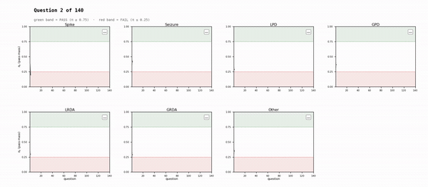

# CORTEX
### Continuous Optimization Response Testing for EEG eXpertise

**An adaptive Bayesian test that measures how well a clinician reads an EEG, and stops the moment it knows the answer.**

The current Python stopping-policy layout is documented in
[`POLICY_LAYOUT.md`](POLICY_LAYOUT.md). AD6 remains the default and rollback
policy in the local Python reference; production selects the frozen
cut-independent PrecisionPolicy for new certification sittings and retains AD6
as rollback. The deployed product surface is the TypeScript application under
[`cortex_web/`](cortex_web/).

For an authoritative map of current versus historical documentation, see
[`docs/README.md`](docs/README.md). Dated phase and simulation reports preserve
the evidence available at the time they were written; they are not current
runtime instructions.

Reading an electroencephalogram is a high stakes judgment call. Is this run
of sharp waves a seizure or a benign rhythm? Two board certified
neurologists can look at the same tracing and disagree, and that
disagreement has consequences for the patient. This project asks a precise
question: given a clinician and a pattern, how skilled are they, really, and
how few questions does it take to find out?

The answer here is not a fixed quiz with a passing score. It is a Bayesian
adaptive test. It maintains a probability distribution over your skill,
chooses each EEG to be the most informative one it could possibly show you
next, and ends as soon as its uncertainty about you is small enough to
certify. Confident readers finish fast. Borderline readers earn a few more
questions. Nobody answers a question the test could have predicted.



*The signal detection model behind the test. Panel A: a reader's response
curve sharpens as skill rises. Panel B: one rater's skill and bias profile
across the seven tasks. Panel C: the fitted cross task skill correlations
that let evidence on one pattern inform belief about another.*

---

## What it measures

The test covers seven tasks at once (K = 7): a binary spike detection
question, and the six ILAE ictal-interictal continuum (IIIC) patterns,
seizure, LPD, GPD, LRDA, GRDA, and Other. Skill on each task is reported the
way clinicians already think about diagnostic accuracy, as an area under the
ROC curve with a credible interval, and each task earns its own verdict:
PASS, FAIL, or REFER. There is no single rolled up grade, because being
excellent at spikes and shaky at rhythmic delta is a real and useful thing
to know.

<div align="center">
  
</div>

*All seven tasks at once: each task's posterior cloud in skill (vertical) versus bias (horizontal) space, colored by task and growing more opaque as the engine grows confident. You can watch where each task settles relative to neutral.*

## How it works, briefly

Every answer is modeled as signal detection with a small lapse rate. A
clinician with bias $t$ and log discrimination $\ell$, shown a segment of
signal strength $s$, says "yes" with probability

$$
P(y = 1) \;=\; \lambda + (1 - 2\lambda)\,\Phi\!\big( e^{\ell}(s + t) \big),
\qquad \lambda = 0.025.
$$

That one likelihood is shared by every component of the system, from
calibration to both inference engines. From there the project runs two
engines that never import each other, by deliberate design:

- The **research engine** (`engine/`) carries the full joint posterior over
  all seven tasks as a particle cloud. After each answer it reweights the
  cloud, and when the effective sample size drops below half it resamples
  and rejuvenates the particles with a short adaptive Metropolis-Hastings
  run, restoring diversity without distorting the distribution. It selects
  each next question by A-optimal design: the EEG whose answer is expected
  to shrink total posterior variance the most. It stops when every task's
  95% AUROC interval is narrower than 0.05.

- The historical **Python deployment reference** (`deployment/`) trades the
  cloud for a Gaussian (Laplace) posterior updated online by an extended
  Kalman filter. It remains useful for scientific reproduction, but it is not
  the live application runtime. Production certification runs the qualified
  TypeScript particle engine in `cortex_web/apps/web/engine/`.

The cut scores themselves are calibrated, not chosen by hand. They come from
a leave one task out cross validated Youden procedure on fitted clinician
skill, which is specifically designed so that the definition of "expert"
cannot leak into the threshold it produces.

**The historical Python derivations live in
[`docs/METHODS.md`](docs/METHODS.md)**, which walks from the response model
through the reference particle filter, the
Metropolis-Hastings rejuvenation step, the A-optimal question selection, the
Kalman update, and the calibration pipeline, with every equation pinned to
the line of code that implements it.

<div align="center">
  
</div>

*The adaptive engine in motion. For each task it carries a joint posterior over the reader's skill and bias (shown as a 3D density and a 2D cloud with its 95% uncertainty ellipse), while the lower panel logs every question by difficulty and domain. The engine chooses each next question to shrink that uncertainty the fastest.*

## Does it actually work

Yes, and the repository is built to let a skeptic check. Skill is recovered
in simulation, posterior intervals have their stated coverage, the engine is
bit for bit reproducible across machines under single thread BLAS, and the
whole thing is replayed against the recorded answers of 21 real clinicians,
not just synthetic raters.



*Per task skill recovery. The error between estimated and true skill
collapses as the adaptive test asks more questions, across all seven tasks
and every expertise tier.*

<div align="center">
  
</div>

*The same thing in a single live session: each task's particle cloud tightens as evidence accumulates, the brighter colors marking a more confident posterior.*

The validation trail is the point, not a footnote. See
[`docs/PHASE7_CLOSEOUT.md`](docs/PHASE7_CLOSEOUT.md) for the scientific gate,
[`docs/INVARIANT_AUDIT.md`](docs/INVARIANT_AUDIT.md) for the reference truth
audit, and [`docs/METHODS.md`](docs/METHODS.md) section 5 for the validation
methods.

## Take the test: the web app

Clinicians take CORTEX through the deployed browser application. It presents
the adaptive sequence of real EEGs, runs the qualified Web Worker engine, and
produces the per-task report at the end. The application, deployment runbook,
and reviewer entry points live under [`cortex_web/`](cortex_web/); start with
the [`cortex_web` README](cortex_web/README.md).

<div align="center">
  
</div>

*What the test produces: per task verdicts forming over a session. Each task's pass-mass climbs into the green PASS band or drops into the red FAIL band, and the monotonic rule locks each verdict the moment it resolves.*

## Quickstart

Python 3.11 is required (see `.python-version`). The root package remains the
historical research/reference install target:

```sh
python -m venv .venv
.venv/bin/pip install -e ".[test]"
.venv/bin/pytest
```

The modular policy packages can also be tested independently:

```sh
(cd termination-policy && python -m pytest -q)
(cd ad6-policy && python -m pytest -q)
(cd precision-policy && python -m pytest -q)
(cd trainer-policy && python -m pytest -q)
```

The canonical production-web setup and quality gate are documented in
[`cortex_web/README.md`](cortex_web/README.md). Historical research checks and
full-instrument tests require governed external EEG/reference fixtures and are
not fresh-clone commands. Test counts are intentionally not hard-coded here
because regression coverage changes.

## Repository map

```
engine/        Research engine: joint SMC particle cloud + Metropolis-Hastings rejuvenation
deployment/    Historical Python deployment reference; not the live web runtime
pipeline/      Data ingest, fitting, and the calibration orchestrator (reference + joint hierarchical)
calibration/   Frozen research/deployment-reference cuts and their provenance
termination-policy/, ad6-policy/, precision-policy/  Standalone Python stopping policies
trainer-policy/ Auditable Python representation of the deployed trainer algorithm
cortex_web/    Canonical deployed web application, API, trainer, and operations
cortex_web_python_reference/  Local scientific integration/reference workspace
scripts/       Bank builders plus validation and experiment harnesses
data/          Corpus metadata, frozen reference inputs, and derived signal banks
docs/          Current documentation index plus dated scientific records
tests/         Root research/reference regression suite
```

## Data, ethics, and reproducibility

The committed label tables contain observations for 94,138 canonical segment
IDs and 5,306 canonical or unresolved source-scoped rater identity rows;
`segment_signals.csv` currently contains fitted signals for 89,138 of those
segments. Those identity rows are not a claim of 5,306 uniquely resolved
people. This provenance carries obligations, and the repository takes them
seriously.

- **IRB.** Annotation data are governed by IRB 2016P000058 (BIDMC) and
  2013P001024 (MGH), under a waiver of consent for retrospective use. Raw EEG
  banks, participant exports, credentials, and identity crosswalks must not be
  included in a public source archive. See
  [`data/DATA_PROVENANCE.md`](data/DATA_PROVENANCE.md) for the publishable
  derivation record.
- **Privacy.** The EEG is de-identified at source. The remaining sensitivity
  is the identities of the board certified clinicians who served as raters,
  which are hashed before any public distribution and never co-published
  with their scores.
- **Reproducibility.** Calibration constants are pinned and runtime
  asserted, two independent copies of the reference fitter are held byte
  equivalent under test, and the engine produces identical results across
  machines. Nothing here is "trust me."

## Status, license, and citation

This is active research software accompanying a manuscript in preparation.
The canonical web runtime and its frozen PrecisionPolicy profile are gated by
the web quality suite; older Python calibration and deployment records remain
available for scientific reproduction.
Released under [CC BY-NC 4.0](LICENSE.txt) (attribution, non commercial).

Authors: **E. W. Keldsen**, **M. B. Westover**. Stanford University School
of Medicine, Department of Neurology. If you use or build on this work,
please cite the repository and the forthcoming manuscript.

## Where to look for what

| Question | Start here |
|---|---|
| How does the math actually work? | [`docs/METHODS.md`](docs/METHODS.md) |
| Is the engine calibrated and validated? | [`docs/PHASE7_CLOSEOUT.md`](docs/PHASE7_CLOSEOUT.md) |
| What is the live deployment contract? | [`cortex_web/docs/PRODUCTION_BASELINE.md`](cortex_web/docs/PRODUCTION_BASELINE.md) + [`cortex_web/deploy/README.md`](cortex_web/deploy/README.md) |
| What does the older Python deployment reference implement? | [`docs/DEPLOYMENT_INTEGRATION.md`](docs/DEPLOYMENT_INTEGRATION.md) |
| How was the corpus built? | [`data/DATA_PROVENANCE.md`](data/DATA_PROVENANCE.md) |
| What are the reference truth invariants? | [`docs/INVARIANT_AUDIT.md`](docs/INVARIANT_AUDIT.md) |
| Which documentation is current? | [`docs/README.md`](docs/README.md) |
| What are the production web boundaries? | [`cortex_web/docs/REPOSITORY_STRUCTURE.md`](cortex_web/docs/REPOSITORY_STRUCTURE.md) |
| The full change history | [`CHANGELOG.md`](CHANGELOG.md) |
| How does the live adaptive trainer work? | [`docs/LIVE_TRAINER.md`](docs/LIVE_TRAINER.md) |

## Live adaptive trainer

The active trainer is the self-contained server-side learning engine under
`cortex_web/learning-engine-cleaned/`. The browser uses a thin authenticated
session adapter and has no local model fallback. Historical root-level trainer
prototypes and ports have been retired; see [`docs/LIVE_TRAINER.md`](docs/LIVE_TRAINER.md)
for the runtime path and reviewer entry points.
